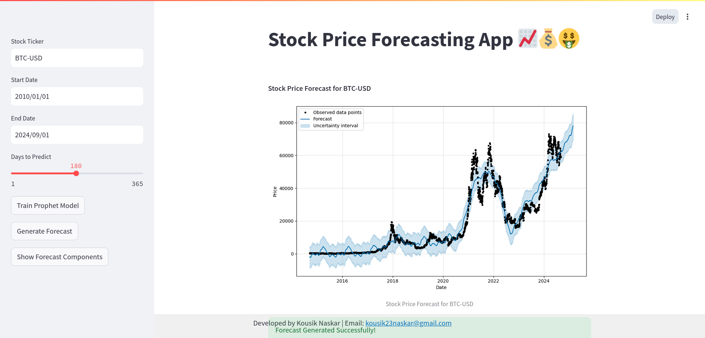

<h1 align="center">💰 Stock Market Prediction App using Facebook Prophet 💸</h1>

<p align="center">
  
</p>

<p align="center">
  Welcome to the Stock Market Prediction using Facebook Prophet project! This repository contains code and resources for predicting stock market trends using the Facebook Prophet model. With Prophet's **decomposable model** (trend + seasonality + holidays), we aim to forecast stock prices and assist in making informed investment decisions.
</p>

## Project Overview 💡
This project leverages historical stock market data to train a Prophet model. The model learns from past price patterns and trends to predict future stock prices. Prophet is designed to capture trend, seasonality, and holiday effects, making it effective for time series forecasting.

## Dataset 📊
We use a publicly available dataset of historical stock prices, which includes data for various assets such as Apple Inc. (AAPL), Microsoft Corporation (MSFT), and Bitcoin (BTC). The dataset contains key features like:

- **Opening Price:** The price of the asset at the start of the trading day.
- **Closing Price:** The price of the asset at the end of the trading day.
- **Volume:** The total number of shares or units traded during the day.
- **High Price:** The highest price at which the asset traded during the day.
- **Low Price:** The lowest price at which the asset traded during the day.

The dataset is sourced from reliable financial data providers like [Yahoo Finance](https://finance.yahoo.com/). We preprocess the data to ensure it is clean and suitable for training the Prophet model, including handling missing values, normalizing data, and splitting it into training and testing sets, and transformed as needed. 🫡

## Model Training 🧑🏻‍💻
Prophet is an open-source tool from Facebook's team that uses an additive model for time series forecasting. The model fits non-linear trends with seasonality and holiday effects. We train the model on desired dataset to make predictions.

## Evaluation and Results 📈
Once the model is trained, we evaluate its performance on the testing dataset. We compute various metrics such as mean squared error (MSE), mean absolute error (MAE) and mean absolute percentage error (MAPE) to assess the model's accuracy. This evaluation part is done in research notebook. We visualize the predicted stock prices alongside the actual prices to gain insights into the model's performance.

## Usage 💪🏻
To run the project locally, follow these steps:

1. **Clone this repository:**
  ```bash
  git clone https://github.com/kousik23naskar/Stock_price_prediction
  ```
2. **Navigate to the project directory:**
  ```bash
  cd Stock_price_prediction
  ```
3. **Create a conda environment:**
  ```bash
  conda create -p venv python=3.11 -y
  ```
4. **Activate the environment:** 
  ```bash
  conda activate ./venv
  ```
5. **Install the necessary dependencies:** 
  ```bash
  pip install -r requirements.txt
  ```
6. **Run the Streamlit app:** 
  ```bash
  streamlit run app.py
  ``` 
7. Interact with the app:
  *Open your web browser and go to the URL provided by Streamlit (usually http://localhost:8501).
  *Use the sidebar to input the stock ticker, date range, and forecast period.
  *Click **Train Prophet Model** to train the model with your inputs.
  *Once the model is trained successfully, you can generate forecasts and view forecast components by clicking the respective buttons.

## Results and Discussion 📊
In this section, we present the results of our stock market prediction experiments. We discuss the model's performance, its strengths, limitations, and potential areas of improvement. We also provide visualizations of the predicted stock prices and compare them with the actual prices.



## Contributing 🤝
We welcome contributions to enhance the project and make it even more effective. If you have any suggestions, bug fixes, or new features to add, please submit a pull request. We appreciate your contributions!

## License 🔐
This project is licensed under the [MIT License](LICENSE).

## Contact 📩
For any questions or inquiries, feel free to reach out to us:
- **Email:** kousik23naskar@gmail.com
- **LinkedIn:** [Kousik Naskar](https://www.linkedin.com/in/dr-kousik-naskar/)

Let's make accurate stock market predictions together!

Thank you for visiting our project repository. Happy predicting! 😇
